<table>
  <tr>
    <td colspan="2">
      <strong>01&nbsp;&nbsp;/&nbsp;&nbsp;HERO SECTION</strong>
    </td>
  </tr>
  <tr>
    <td width="39%" valign="top">
      
    </td>
    <td width="61%" valign="middle">
      <h1>Hi, I'm Avinash Kumar</h1>
      <h3>Full Stack Developer React.js &bull; Next.js &bull; Node.js</h3>
      

        Building scalable web applications with modern JavaScript technologies.
      

      

        I enjoy transforming ideas into polished digital products by combining intuitive user experiences, robust backend architecture, and AI-powered solutions that solve real-world problems.
      

      <blockquote>
        Building products that are fast, scalable, and built for real users.
      </blockquote>
      

        
        
        
        
      

      <table>
        <tr>
          <td align="center" width="25%">
            <strong>5</strong> 
            Internships
          </td>
          <td align="center" width="25%">
            <strong>2</strong> 
            Featured Projects
          </td>
          <td align="center" width="25%">
            <strong>1+</strong> 
            Year Experience
          </td>
          <td align="center" width="25%">
            <strong>2026</strong> 
            B.Tech CSE
          </td>
        </tr>
      </table>
    </td>
  </tr>
</table>

 

## About

I build web applications from the interface down to the data layer. My recent work includes a College ERP platform, an AI-driven meeting assistant, secure REST API modules, real-time attendance workflows, SQL performance tuning, and VAPT assessments on live web applications.

I prefer direct engineering: clear flows, small API surfaces, responsive UI, measurable performance work, and security checks early enough that they shape the implementation rather than clean up after it.

 

## Highlights

<table>
  <tr>
    <td width="33%" valign="top">
      <h3>Full Stack Systems</h3>
      
Worked across MERN and Next.js applications, including frontend screens, backend APIs, authentication, and database-backed workflows.

    </td>
    <td width="33%" valign="top">
      <h3>AI Product Layer</h3>
      
Built an AI meeting assistant using Gemini AI that reduced manual documentation effort by 70%.

    </td>
    <td width="33%" valign="top">
      <h3>Database Performance</h3>
      
Improved SQL response speed by 30% and raised MongoDB retrieval speed by 25% through schema and query work.

    </td>
  </tr>
  <tr>
    <td width="33%" valign="top">
      <h3>API Delivery</h3>
      
Built 15+ secure RESTful API endpoints with Node.js and Express.js for authentication and attendance logging.

    </td>
    <td width="33%" valign="top">
      <h3>Security Practice</h3>
      
Performed VAPT on 5+ live web applications and reduced attack surfaces by 25% using OWASP-based testing.

    </td>
    <td width="33%" valign="top">
      <h3>Execution Quality</h3>
      
Resolved 20+ frontend and backend issues, helped reduce post-release bugs, and supported QA cycles.

    </td>
  </tr>
</table>

 

## Tech Stack

<table>
  <tr>
    <td width="18%"><strong>Frontend</strong></td>
    <td>
      
      
      
      
      
      
    </td>
  </tr>
  <tr>
    <td><strong>Backend</strong></td>
    <td>
      
      
      
      
      
    </td>
  </tr>
  <tr>
    <td><strong>Database</strong></td>
    <td>
      
      
      
    </td>
  </tr>
  <tr>
    <td><strong>Languages</strong></td>
    <td>
      
      
      
      
    </td>
  </tr>
  <tr>
    <td><strong>AI</strong></td>
    <td>
      
      
    </td>
  </tr>
  <tr>
    <td><strong>Security</strong></td>
    <td>
      
      
      
    </td>
  </tr>
  <tr>
    <td><strong>CS Core</strong></td>
    <td>
      
      
      
      
    </td>
  </tr>
  <tr>
    <td><strong>Tools</strong></td>
    <td>
      
      
      
      
      
      
      
      
    </td>
  </tr>
</table>

 

## Featured Projects

<table>
  <tr>
    <td width="50%" valign="top">
      <h3>Smart Meeting Assistant</h3>
      

        AI video platform with real-time conferencing, screen sharing, and automated meeting intelligence.
      

      

        <strong>Overview</strong> 
        Architected a low-latency video collaboration workflow using Next.js and Stream SDK, then added a Gemini AI layer for automated summaries.
      

      

        <strong>Tech</strong> 
        Next.js, Stream SDK, Gemini AI
      

      

        <strong>Impact</strong> 
        Reduced manual documentation effort by 70%.
      

      

        
        
      

    </td>
    <td width="50%" valign="top">
      <h3>Movie Discovery Platform</h3>
      

        FlickFinder is a responsive movie discovery experience with real-time search, tracking, and trailer playback.
      

      

        <strong>Overview</strong> 
        Built with React.js and the TMDB API, with React Hooks and LocalStorage caching to keep discovery fast.
      

      

        <strong>Tech</strong> 
        React.js, JavaScript ES6+, TMDB API, CSS3
      

      

        <strong>Impact</strong> 
        Reduced search latency by 40%.
      

      

        
        
      

    </td>
  </tr>
</table>

 

## Experience Timeline

<table>
  <tr>
    <td width="24%"><strong>Viralstan</strong> Jan 2026 - May 2026 | On-site</td>
    <td width="26%">Full Stack Developer Intern</td>
    <td>Developed and maintained parallel web application workstreams, resolved 20+ frontend/backend issues, improved turnaround time by close to 15%, and supported QA cycles that reduced post-release bug reports by nearly 10%.</td>
  </tr>
  <tr>
    <td><strong>WEBTECHFLY</strong> Jan 2026 - May 2026 | Hybrid</td>
    <td>MERN Stack Developer Intern</td>
    <td>Restructured MongoDB schemas and aggregation pipelines to improve retrieval speed by 25%, and built 15+ secure RESTful API endpoints for authentication and real-time attendance logging.</td>
  </tr>
  <tr>
    <td><strong>Celebal Technologies</strong> June 2025 - Aug 2025 | Remote</td>
    <td>SQL Intern</td>
    <td>Tuned complex SQL queries for 30% faster responses and audited datasets across module testing and reporting workflows.</td>
  </tr>
  <tr>
    <td><strong>HighRadius</strong> May 2025 - June 2025 | Remote</td>
    <td>Marketing Intern</td>
    <td>Used market and CRM data to support product-positioning decisions and improve lead engagement by 20%.</td>
  </tr>
  <tr>
    <td><strong>Offdef Cyber Solutions LLP</strong> June 2024 - July 2024 | Remote</td>
    <td>Ethical Hacking Intern</td>
    <td>Carried out VAPT on 5+ live web applications, reduced attack surfaces by 25%, and executed network security audits that strengthened threat detection frameworks by 40%.</td>
  </tr>
</table>

 

## GitHub Analytics

  
  

  

 

## Certifications

<table>
  <tr>
    <td width="25%" valign="top">
      <strong>Generative AI</strong> 
      Career Essentials in Generative AI by Microsoft and LinkedIn
    </td>
    <td width="25%" valign="top">
      <strong>Google Cloud</strong> 
      GenAI Studio
    </td>
    <td width="25%" valign="top">
      <strong>AI and Analytics</strong> 
      Identity Security for the AI Age by Saviynt and GenAI Powered Data Analytics by Tata
    </td>
    <td width="25%" valign="top">
      <strong>Cybersecurity</strong> 
      Professional Certification in VAPT by ACIC Rise Association, CEC Landran
    </td>
  </tr>
</table>

 

## Connect

<table>
  <tr>
    <td width="62%" valign="top">
      <strong>Open to full-time software engineering opportunities.</strong>
       
      I am looking for engineering teams where frontend quality, backend reliability, database performance, and security awareness all matter.
    </td>
    <td width="38%" align="right" valign="middle">
      
      
      
    </td>
  </tr>
</table>
